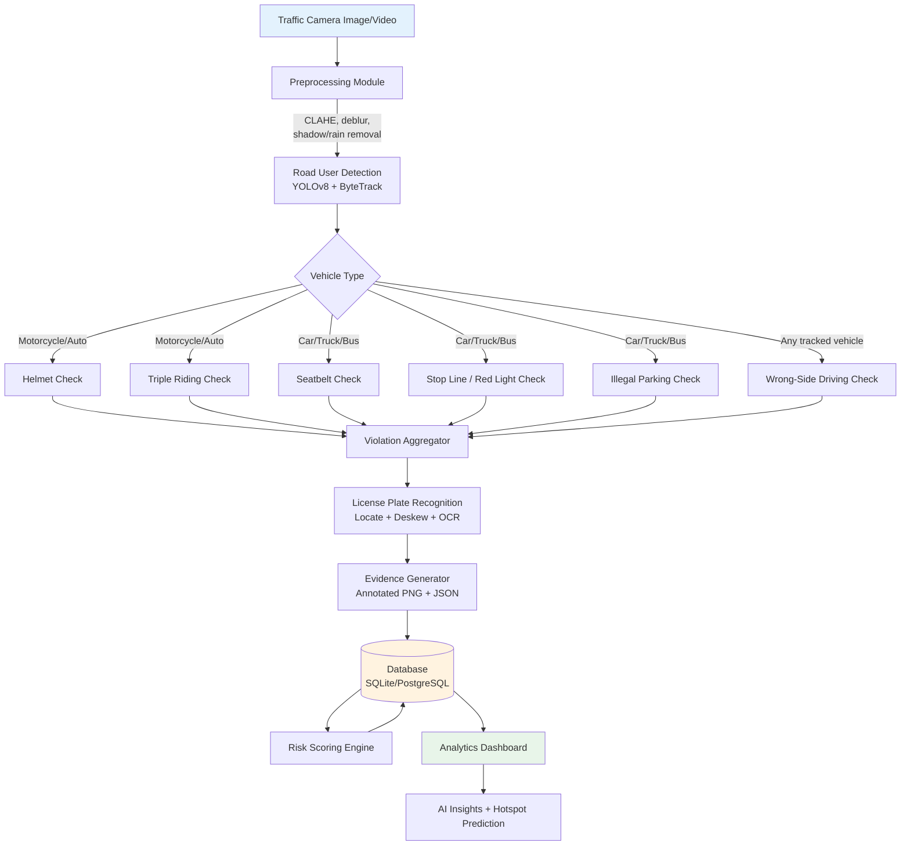

# Architecture Diagram

Paste into any Mermaid-compatible renderer (mermaid.live, GitHub markdown
preview, or the pptx skill's diagram support) for a slide-ready graphic.

```mermaid
flowchart TD
    A[Traffic Camera Image/Video] --> B[Preprocessing Module]
    B -->|CLAHE, deblur,<br/>shadow/rain removal| C[Road User Detection<br/>YOLOv8 + ByteTrack]
    C --> D{Vehicle Type}
    D -->|Motorcycle/Auto| E[Helmet Check]
    D -->|Motorcycle/Auto| F[Triple Riding Check]
    D -->|Car/Truck/Bus| G[Seatbelt Check]
    D -->|Car/Truck/Bus| H[Stop Line / Red Light Check]
    D -->|Car/Truck/Bus| I[Illegal Parking Check]
    D -->|Any tracked vehicle| J[Wrong-Side Driving Check]

    E --> K[Violation Aggregator]
    F --> K
    G --> K
    H --> K
    I --> K
    J --> K

    K --> L[License Plate Recognition<br/>Locate + Deskew + OCR]
    L --> M[Evidence Generator<br/>Annotated PNG + JSON]
    M --> N[(Database<br/>SQLite/PostgreSQL)]
    N --> O[Risk Scoring Engine]
    N --> P[Analytics Dashboard]
    O --> N
    P --> Q[AI Insights + Hotspot Prediction]

    style A fill:#e3f2fd
    style N fill:#fff3e0
    style P fill:#e8f5e9
```
