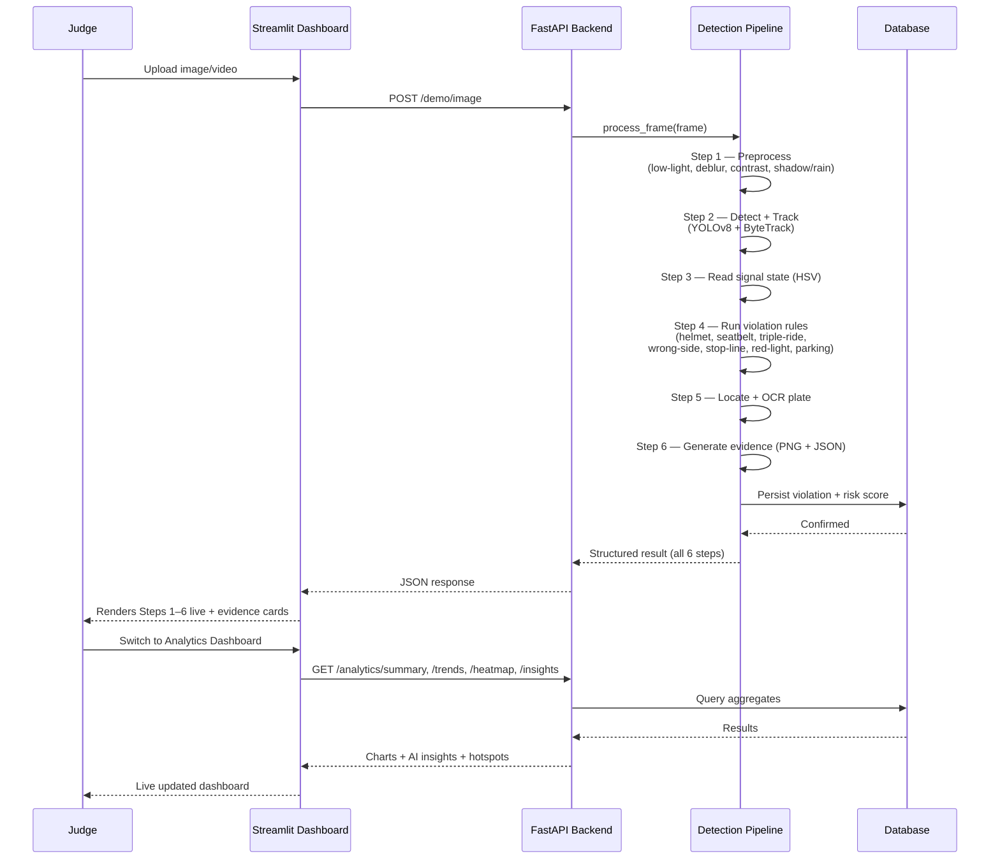

# Judge Demo Mode — Workflow Diagram

```mermaid
sequenceDiagram
    participant Judge
    participant Dashboard as Streamlit Dashboard
    participant API as FastAPI Backend
    participant Pipeline as Detection Pipeline
    participant DB as Database

    Judge->>Dashboard: Upload image/video
    Dashboard->>API: POST /demo/image
    API->>Pipeline: process_frame(frame)

    Pipeline->>Pipeline: Step 1 — Preprocess<br/>(low-light, deblur, contrast, shadow/rain)
    Pipeline->>Pipeline: Step 2 — Detect + Track<br/>(YOLOv8 + ByteTrack)
    Pipeline->>Pipeline: Step 3 — Read signal state (HSV)
    Pipeline->>Pipeline: Step 4 — Run violation rules<br/>(helmet, seatbelt, triple-ride,<br/>wrong-side, stop-line, red-light, parking)
    Pipeline->>Pipeline: Step 5 — Locate + OCR plate
    Pipeline->>Pipeline: Step 6 — Generate evidence (PNG + JSON)
    Pipeline->>DB: Persist violation + risk score
    DB-->>Pipeline: Confirmed
    Pipeline-->>API: Structured result (all 6 steps)
    API-->>Dashboard: JSON response
    Dashboard-->>Judge: Renders Steps 1–6 live + evidence cards

    Judge->>Dashboard: Switch to Analytics Dashboard
    Dashboard->>API: GET /analytics/summary, /trends, /heatmap, /insights
    API->>DB: Query aggregates
    DB-->>API: Results
    API-->>Dashboard: Charts + AI insights + hotspots
    Dashboard-->>Judge: Live updated dashboard
```
